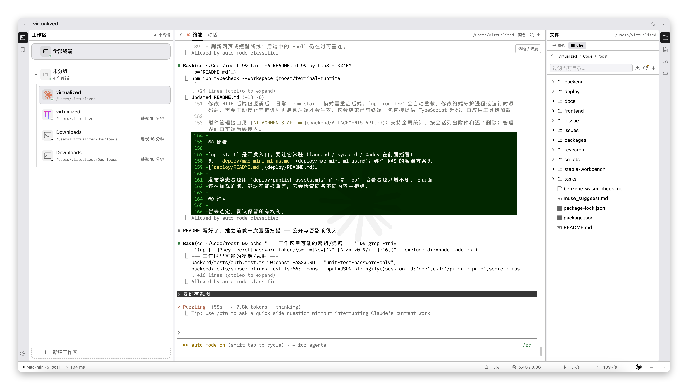

# Roost

[中文](README.md) · **English**

**A local workbench for managing shell sessions in the browser. Close the tab; what's
running inside keeps running.**



`tmux` keeps sessions alive but has no idea what's running inside them. Web terminals are
convenient, but the session usually dies with the page. Roost wants both — the scenarios
below are what it actually solves.

## One design rule: don't steal space from the terminal

**The terminal is the main act. Nothing else gets to live there permanently.**

File preview and editing are **floating windows** — draggable, resizable, pinnable, closed
when you're done. They sit *on top of* the terminal; they never squeeze it narrower. The
right-hand panel (file tree, notes, system info, processes) is summoned the same way: click
it open from the icon rail, collapse it when you're done.

This isn't about looks. Squeeze a terminal narrower and every full-screen TUI inside has to
repaint; change the width and **output that was produced at the old width gets re-wrapped**
— tables break apart, cursor-relative redraws land on half a frame. So in Roost, glancing at
a file, jotting a note, or checking a port never disturbs the screen you're watching.

---

### "The AI is working — I want to go do something else"

An AI CLI can run for twenty minutes, and those are exactly the twenty minutes you need to
be elsewhere.

The PTY is held by a separate process, so **closing the tab, restarting the backend, or
losing the network for ten minutes doesn't interrupt it**. The sidebar shows live state for
every session — working / done / **waiting for your approval** — sends a browser
notification when things go quiet, and puts an unread count in the tab title.

That state comes from each CLI's own hooks and protocol, **not from scraping the screen**.
So a busy progress bar is never mistaken for "still working," and a confirmation prompt
that's been sitting there waiting for you is never missed.

### "Pick it up on another machine"

One session can have several windows open at once, and **each window resumes from the point
it had already displayed** — nothing replayed, nothing skipped in between. Leave it open on
the Mac at work, open it again at home; neither disturbs the other.

Different window sizes don't fight, either: the daemon inserts size changes into the output
stream in order, and the client re-wraps at **the correct byte position** — so changing the
width never re-folds output that came before it.

### "The network is slow and typing lags"

Two to three hundred milliseconds round trip means every keystroke waits for a round trip.

Roost does **local echo prediction**: the keystroke is painted immediately, then reconciled
against the real echo and rolled back if they disagree. It's an overlay — it never enters
the parser and never touches the wire, so the worst case is one wasted frame. **It keeps
working inside full-screen TUIs**, which is exactly where comparable approaches give up.
The status bar shows a latency reading, and tells you how stale that reading is.

### "I want to keep what just scrolled by"

Select a chunk of output and **save it as a note** or **as a snippet**. Notes travel with
the session; snippets go to the library.

Every session also keeps a full archive you can page through, search, and download.

### "Hand the CLI an image, or a path"

Paste a screenshot straight into the terminal and it's inserted the way that particular CLI
expects. **Drag a file from the tree into the terminal and it becomes a path.** The tree
offers both tree and list browsing, a fast server-side search in a single walk, uploads and
downloads, and a context menu.

Preview handles code, images, PDF, Markdown, and 3D molecules. Edits are written back
atomically and detect changes made outside. The window drags, resizes, and can be pinned so
you can read and type at the same time.

### "How is this machine doing right now"

There's a built-in system panel, so you don't need a second tool open: CPU (user / system /
idle, frequency, cache, sockets), memory (active / cached / dirty / writeback), disk read and
write rates and totals, connection counts, **listening ports and UDP bindings**, process
state breakdown (running / sleeping / blocked / zombie), top consumers, GPU, kernel and time
zone, and whether the handful of services you care about are up.

You can also see **what services this particular terminal started and which ports they hold**
— matched by controlling terminal rather than parent-child, so a process that gets reparented
is still tracked.

### "Draw a molecule while I'm here"

`.mol` / `.sdf` open in the browser for editing, and go straight into the terminal when
you're done.

---

Roost doesn't provide the AI — that comes from whatever CLI you run yourself. It currently
recognizes **Claude Code / Codex / Gemini CLI / OpenCode / Qwen Code / Grok / Oh My Pi**.
The interface is bilingual (Chinese / English).

## Getting it running

Requires **Node.js ≥ 22.13.0** (the floor comes from `node:sqlite`).

```sh
npm ci        # first time, from the repo root
npm start     # open http://localhost:5173
cat ~/.roost/auth-password   # the random password generated on first start
```

## Security boundary

This is not a hosted service. There is no multi-tenancy and no permission model.
Authentication is a single gate: a locally generated random password in
`~/.roost/auth-password` (mode 0600).

**It keeps out other people on your network; it is not designed for exposure to the public
internet.** Anyone who gets in can run arbitrary commands on your machine. If you do put it
behind a public address, add another layer of access control at the reverse proxy.

Plain HTTP access must be opted into with `ROOST_AUTH_INSECURE_HTTP=1`; cross-origin access
is declared with `ROOST_ALLOWED_ORIGINS`.

## Installing it as a system service

`npm start` is the development entry point — close it and the terminals stop. To keep it
running:

```sh
npm ci && npm run build --workspace frontend
brew install caddy
npm run service:install     # entry point http://localhost:8080
```

`npm run service:status` shows state, `service:uninstall` removes it (leaving your data
alone), and `node scripts/install-service.mjs --dry-run` prints what it would write without
touching anything.

**Three services rather than one**, because the PTYs have to live in a process that doesn't
restart just because you changed some code:

| Service | What it runs |
| --- | --- |
| `com.roost.terminal` | every PTY lives in this process |
| `com.roost.backend` | waits for the owner, then starts the HTTP backend |
| `com.roost.web` | static assets plus a reverse proxy for `/api` |

Restart `backend` and `web` as often as you like; terminals are unaffected. **Restarting
`terminal` ends every session.** Logs are in `~/.roost/logs/`.

systemd on Linux works the same way, but read
[the Linux/systemd notes](deploy/linux-systemd.md) before writing a unit — five common
hardening directives break Roost in ways that are hard to trace (`sudo` stops working,
the backend can never find the daemon, …). The notes are in Chinese.
For Synology NAS, see [`deploy/README.md`](deploy/README.md).

After changing the frontend, publish with
`npm run build --workspace frontend && npm run publish` — **assets first, shell second**.
The other order leaves a window where the entry script 404s and the page is blank.

## Things worth knowing

- **If the daemon exits or the machine reboots, running tasks cannot be recovered.**
  Everything else — refresh, network drop, backend restart, backend crash — can.
  `npm run daemon:status` / `daemon:stop` manage it.
- **Hide** only hides; the process keeps running. **Kill** ends it and deletes the record.
  "Restart terminal" after a shell exits starts a *new* process — the saved screen doesn't
  mean the old program is still alive.
- History has a size cap; when it's exceeded, recent content is kept and the page says so.
  The archive defaults to a 256 MiB cap.
- Data lives in `~/.roost/workspace.sqlite` by default; `ROOST_DATA_DIR` moves it.

## Development

```sh
npm run dev      # backend reloads on change, PTYs keep running
                 # (same port as npm start — don't run both)
npm run verify   # typecheck + tests + frontend build + dependency boundary check
```

After changing daemon or runtime source, **you must stop the daemon and start it again for
the change to take effect, which ends existing terminals**.

Packages live in `packages/` (protocol, runtime, daemon, store, attachments, CLI adapters);
the applications are `backend/` and `frontend/`. Packages import each other only through
public entry points, and `verify` enforces that. See the
[terminal daemon notes](packages/terminal-daemon/README.md).

## Whose shoulders this stands on

A fair amount of Roost was learned from other projects. `research/` keeps one note per
investigation: **what source was read, what was taken from it, and what was deliberately
left behind.**

**Borrowed:**

- **[tty7](https://github.com/l0ng-ai/tty7)** (a terminal workbench in the same category,
  written in Rust) — both "size echo" and "replay segmented by the geometry it was recorded
  at" came from reading its source. The core insight: a resize has to be synchronized
  **inside the byte stream**, not merely "sent at the same time" — otherwise bytes already
  in flight, produced at the old width, get parsed at the new one.
- **Warp** — "guess less; let the other side tell you." Moving AI state detection from
  screen scraping to each CLI's own hooks and protocol is a direction this confirmed.
- **mosh** — synchronize *what the screen looks like now* rather than chasing the byte
  stream. Our replay re-serializes the current screen from a server-side grid, which is the
  same idea.
- **tmux** — client/server separation, and "slowing down for the slowest viewer punishes
  everyone": it implemented producer throttling in 2009, 2015 and 2016, and removed it all
  three times. That's why we drop frames rather than pause the PTY.
- **xterm.js**, **node-pty**, **Ketcher** and others make up the terminal, PTY and molecule
  editing foundations.

The **deliberately-not-copied** list is written down too, because the reasoning is worth
more than the conclusion: tty7's local line editor (too narrow a set of preconditions — it
effectively doesn't exist inside agent TUIs), systemd/launchd socket activation (preserves
only the listening socket, not the process, which is orthogonal to our problem), and
`process.execve` hot handoff (every failure mode is silent — see
[`research/daemon-handoff-findings.md`](research/daemon-handoff-findings.md), in Chinese).

**Where we went further:**

- **Local echo prediction that keeps working inside full-screen TUIs.** Comparable
  approaches only dare take over when a shell prompt marker says it's safe, so they do
  nothing in vim, htop, or any agent TUI — which is exactly our main case. Ours is an
  overlay: never enters the parser, never touches the wire, rolls back on disagreement,
  worst case one wasted frame.
- **Latency is measured on the link that actually carries keystrokes**, and how stale the
  reading is gets modelled explicitly. Latency measured on a different channel is not the
  number you feel while typing.
- **Replay is a re-serialized current screen, not raw history.** That makes an entire class
  of "mode compensation" bugs impossible here — alternate-screen state travels with the
  snapshot, so nothing has to be folded back in.
- **When pressing Enter on an agent's behalf, we wait for the echo, not for a timer.**
  Others sleep 200ms and hope; we wait until our own text appears on screen. Wait for
  evidence, not for time.
- **One private app-server socket per PTY.** The vendor documentation says a third-party
  observer can't reliably associate a TUI with a specific session — but a socket with
  exactly one TUI on it leaves nothing to guess.

## For AI assistants

Read **[AGENTS.md](AGENTS.md)** first: the things you can't see by reading the code but
that hurt when you hit them. [CLAUDE.md](CLAUDE.md) points at the same file.

`issues/` holds verified defects; `research/` holds investigation notes — including several
"looked into it, decided not to" conclusions and the reasoning behind them.

Both are written in Chinese.

## License

[MIT](LICENSE).
